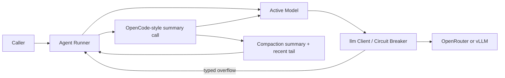

# Reactive Context Compaction

## 1. Problem statement

SafeAgent sends the full in-memory history on each model turn and stops when a provider rejects that history for exceeding its context window. Long tool-driven runs therefore fail instead of preserving their active task and continuing. The runtime needs bounded, automatic recovery that works with OpenRouter and vLLM without requiring proactive token limits or a session database.

## 2. Goals

- Recognize context-overflow responses from OpenRouter and vLLM without treating ordinary request errors as overflow.
- Compact older history after an overflow, retain the active conversation tail, and retry the failed turn once.
- Enable automatic compaction by default with a runner-level opt-out that also governs nested agent runs.
- Return reusable compacted history and account for successful summarization and retry usage.
- Preserve the current default logging posture: full requests and compaction content appear only when `SlogTracer.IncludeSensitiveData` is true.

## 3. Non-Goals

- No proactive context-window monitoring or token-threshold trigger; the provider error starts compaction.
- No `/models` metadata changes; OpenRouter's `context_length` and vLLM's `max_model_len` can support a later proactive phase.
- No durable session store, raw-history archive, compaction rollback, or process-restart recovery; callers remain responsible for retaining `RunResult.History`.
- No full OpenCode persistence, plugin, media-stripping, or background tool-output-pruning system; this project ports only the compaction behavior needed for recovery.
- No streaming support or recovery from output truncation such as `finish_reason: "length"`.
- No attempt to summarize a single oversized current user turn when no older history can be removed.

## 4. Constraints and assumptions

- The implementation targets Go 1.26.4 and follows `go/AGENTS.md`, including test-first RED/GREEN work, `testify/require`, and top-level parallel tests.
- Add no dependency for tokenization or summarization. The active agent model performs compaction without tools.
- `Runner.DisableCompaction` is the settled opt-out. Its zero value keeps automatic compaction enabled.
- The classifier must prefer structured fields. OpenRouter reports HTTP 400 with `error.metadata.error_type == "context_length_exceeded"`; legacy bodies may use `error.code == "context_length_exceeded"`.
- vLLM reports HTTP 400 with a generic `BadRequestError`; classification must use narrow message patterns such as `Input length ... exceeds ... context length`.
- Circuit-breaker fallbacks run before the runner compacts. Overflow remains a non-counted provider-health failure.
- Compaction follows OpenCode's anchored summary format, keeps the last two complete user turns, and limits each old tool output sent to the summarizer to 2,000 characters.
- The runner makes at most one automatic compaction and one retry for a failed turn. A second overflow returns an error.
- [ASSUMED: A compaction model call is auxiliary work and does not consume `Runner.MaxTurns`; its successful usage still contributes to `RunResult.Usage`.]
- [ASSUMED: `RunResult.History` becomes the effective continuation history after compaction, so it may omit the original summarized prefix.]
- `RunResult.NewItems` keeps generated items in chronological order, including each `CompactionSummary`.
- Failed provider calls contribute no usage unless the provider returns usable accounting.
- The existing tracer interface remains stable. It observes the failed request, summary request, and retry through `ModelCallEnded`.

## 5. Architecture sketch



The `llm` package converts provider responses into a typed overflow error. The agent runner owns recovery: it summarizes the removable prefix, rewrites its in-memory history, rebuilds the original request, and retries once.

## 6. Interface sketches

```go
package llm

// ContextOverflowError reports that a request exceeded a model's context.
// Err retains the provider status error or custom model error.
type ContextOverflowError struct {
	Err error
}

func (e *ContextOverflowError) Error() string
func (e *ContextOverflowError) Unwrap() error

package agent

// CompactionSummary replaces an older history prefix with an anchored summary.
// Request serialization expands it into the OpenCode-style user prompt and
// assistant summary pair.
type CompactionSummary struct {
	Content string
}

type Runner struct {
	MaxTurns int
	Context any
	Tracer Tracer

	// DisableCompaction returns context-overflow errors without summarizing or
	// retrying. The zero value enables automatic compaction.
	DisableCompaction bool
}

type RunResult struct {
	FinalOutput string

	// NewItems includes generated model output, tool output, and compaction
	// summaries in chronological order.
	NewItems []Item

	// History is the effective history to pass to a later RunItems call. After
	// compaction it contains the anchored summary and retained recent turns.
	History []Item

	LastAgent *Agent
	Usage Usage
	InputGuardrailResults []InputGuardrailResult
	OutputGuardrailResults []OutputGuardrailResult
}

// Existing public methods keep their signatures.
func (r *Runner) Run(ctx context.Context, agent *Agent, input string) (*RunResult, error)
func (r *Runner) RunItems(ctx context.Context, agent *Agent, input []Item) (*RunResult, error)
```

`ContextOverflowError` is public so custom `Model` implementations can request the same recovery path. No public compactor interface is needed because this project has one strategy and uses the active model.

## 7. Project acceptance criteria

AC-1: `cd go && go test -mod=readonly -race -run 'TestClient_Complete|TestCircuitBreaker_Complete' ./llm` -> exit 0; tests cover OpenRouter's structured overflow, legacy codes, vLLM messages, ordinary 400 responses, and circuit-breaker behavior.

AC-2: `cd go && go test -mod=readonly -race -run 'TestRunner_Run' ./agent` -> exit 0; tests prove default reactive compaction, direct opt-out, one retry, anchored summaries, two retained user turns, complete tool pairs, usage accounting, and bounded failure.

AC-3: `cd go && go test -mod=readonly -race -run 'TestAgent_AsTool' ./agent` -> exit 0; tests prove that `Runner.DisableCompaction` propagates to nested agent runs.

AC-4: `cd go && go test -mod=readonly -race -run 'TestSlogTracer' ./agent` -> exit 0; tests prove that compaction does not expose requests, summaries, or history unless `IncludeSensitiveData` is true.

AC-5: `make vet` -> exit 0 with no formatter or linter failures.

AC-6: `make test` -> exit 0 with all short race-enabled tests passing.

## 8. Phased plan

### Phase 1: Type Provider Overflow
**Status:** [ ] NOT STARTED
<!-- [ ] NOT STARTED | [~] IN PROGRESS | [x] COMPLETE (date, verified by: <command and result>; code review: <result>) -->
**Outcome:** The `llm` package returns a typed, wrapped error for real OpenRouter and vLLM context overflows.
**Changes:**
- Add `ContextOverflowError` with error unwrapping.
- Parse OpenRouter's stable `metadata.error_type` first, then its legacy context code.
- Add narrow vLLM and OpenCode-derived message patterns; reject unrelated 400 responses.
- Preserve circuit-breaker fallback behavior and keep overflow failures out of provider-health counts.
- Add RED/GREEN coverage inside the existing client and circuit-breaker test suites.
**Out of scope:** Agent history changes, summarization, retry, and configuration.
**Verification (orchestrator-owned):** `cd go && go test -mod=readonly -race -run 'TestClient_Complete|TestCircuitBreaker_Complete' ./llm` -> exit 0; all overflow and non-overflow cases pass.

### Phase 2: Compact and Retry
**Status:** [ ] NOT STARTED
<!-- [ ] NOT STARTED | [~] IN PROGRESS | [x] COMPLETE (date, verified by: <command and result>; code review: <result>) -->
**Depends on:** Phase 1.
**Outcome:** A default runner recovers once from context overflow and returns effective compacted history.
**Changes:**
- Add `CompactionSummary` and serialize it as OpenCode's compaction question plus assistant summary.
- Port OpenCode's anchored summary prompt and fixed Markdown result structure.
- Select the removable prefix at complete user-turn boundaries, keep the last two user turns, and truncate old tool output only in the summary request.
- On typed overflow, summarize with the active model and no tools, rebuild the original request from compacted history, and retry once.
- Merge a prior `CompactionSummary` through `<previous-summary>` during later compactions.
- Add summary and retry usage; keep auxiliary calls outside `MaxTurns`.
- Honor `Runner.DisableCompaction` by returning the original overflow without summarizing or retrying.
- Return the original overflow when no prefix is compactable, and stop after a summary or retry overflow.
- Add RED/GREEN runner tests for history shape, role order, tool-pair integrity, usage, and bounded failure.
**Out of scope:** Nested-run opt-out propagation, proactive limits, persistent raw history, and new tracer methods.
**Verification (orchestrator-owned):** `cd go && go test -mod=readonly -race -run 'TestRunner_Run' ./agent` -> exit 0; all compaction and existing runner cases pass.

### Phase 3: Opt-Out, Observability, and Release Checks
**Status:** [ ] NOT STARTED
<!-- [ ] NOT STARTED | [~] IN PROGRESS | [x] COMPLETE (date, verified by: <command and result>; code review: <result>) -->
**Depends on:** Phase 2.
**Outcome:** Callers can disable compaction across a run tree, logs preserve existing privacy defaults, and the repository passes release checks.
**Changes:**
- Propagate `Runner.DisableCompaction` through `RunContext` to nested `Agent.AsTool` runners.
- Verify that disabled runners return the original overflow without a summary call or retry.
- Route compaction calls through existing tracer events without logging sensitive content by default.
- Update public comments and package examples for effective history, default behavior, opt-out, and the no-persistence boundary.
- Add RED/GREEN nested-run and `SlogTracer` regression tests.
**Out of scope:** A session API, JSON history codec, metrics API, or new tracing callbacks.
**Verification (orchestrator-owned):** Run `make vet` -> exit 0, then `make test` -> exit 0. Do not rerun the phase-specific commands that already passed.

## 9. Open questions

None.
